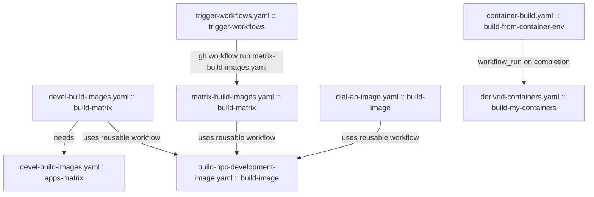

# GitHub Actions Dependency Tree

Generated: 2026-07-13

This document maps dependencies between workflow files and jobs in `.github/workflows`.

## Overview

## File-Level Dependencies

- devel-build-images.yaml -> build-hpc-development-image.yaml
- matrix-build-images.yaml -> build-hpc-development-image.yaml
- dial-an-image.yaml -> build-hpc-development-image.yaml
- container-build.yaml -> derived-containers.yaml (via `workflow_run`)
- trigger-workflows.yaml -> matrix-build-images.yaml (via `gh workflow run` shell command)

## Job-Level Dependencies

- devel-build-images.yaml
  - build-matrix (calls reusable workflow)
  - apps-matrix (needs: build-matrix)

- matrix-build-images.yaml
  - build-matrix (calls reusable workflow)

- dial-an-image.yaml
  - build-image (calls reusable workflow)

- build-hpc-development-image.yaml
  - build-image (reusable workflow entrypoint job)

- container-build.yaml
  - build-from-container-env

- derived-containers.yaml
  - build-my-containers (triggered by completed runs of workflow named "Container Build")

- trigger-workflows.yaml
  - trigger-workflows (dispatches matrix-build-images.yaml)

## Workflows With No Explicit Cross-Workflow Links

- conda-build.yaml
- matrix-smoketest-applications.yaml
- manually-clean-action-log.yaml
- cron-clean-action-log.yaml
