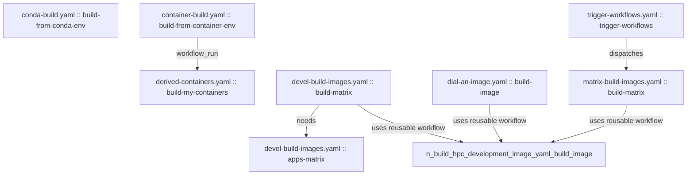

# GitHub Actions Dependency Tree

Generated: 2026-07-13 19:49 UTC

This document is manually maintained.

## Overview

## File-Level Dependencies

- container-build.yaml -> derived-containers.yaml (workflow_run)
- devel-build-images.yaml -> build-hpc-development-image.yaml (uses reusable workflow)
- dial-an-image.yaml -> build-hpc-development-image.yaml (uses reusable workflow)
- matrix-build-images.yaml -> build-hpc-development-image.yaml (uses reusable workflow)
- trigger-workflows.yaml -> matrix-build-images.yaml (dispatches)

## Job-Level Dependencies

- container-build.yaml::build-from-container-env -> derived-containers.yaml::build-my-containers (workflow_run)
- devel-build-images.yaml::build-matrix -> build-hpc-development-image.yaml::build-image (uses reusable workflow)
- devel-build-images.yaml::build-matrix -> devel-build-images.yaml::apps-matrix (needs)
- dial-an-image.yaml::build-image -> build-hpc-development-image.yaml::build-image (uses reusable workflow)
- matrix-build-images.yaml::build-matrix -> build-hpc-development-image.yaml::build-image (uses reusable workflow)
- trigger-workflows.yaml::trigger-workflows -> matrix-build-images.yaml::build-matrix (dispatches)

## Workflows With No Explicit Cross-Workflow Links

- conda-build.yaml
- cron-clean-action-log.yaml
- manually-clean-action-log.yaml
- matrix-smoketest-applications.yaml
- mega-linter.yml
