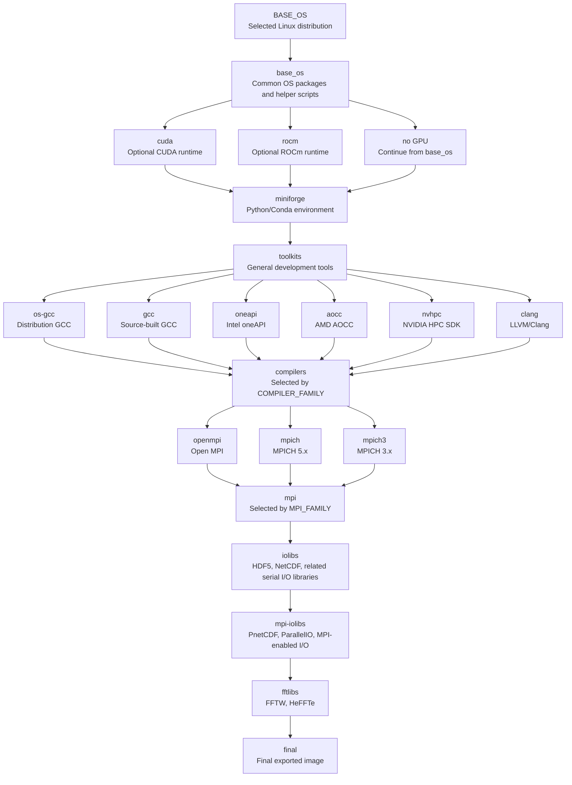
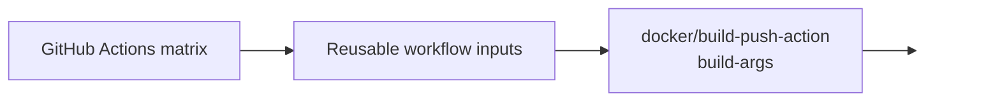
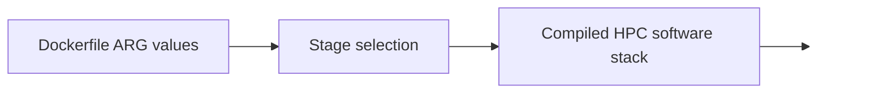
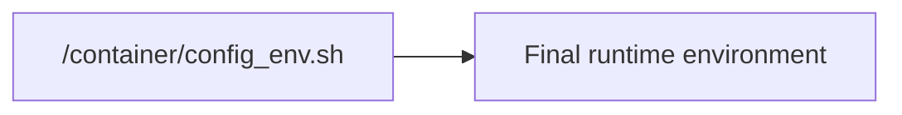

# Dockerfile Architecture Summary

This document summarizes the structure of `containers/devenv/Dockerfile`, the major image
layers it constructs, and the dependency flow used to assemble the final HPC development
container image.

## Overall Summary

The `containers/devenv/Dockerfile` defines a multi-stage Docker build for producing
containerized high-performance computing development environments.

The Dockerfile is not a single linear image recipe. Instead, it is a configurable build
graph. Docker build arguments select:

- the base Linux distribution,
- whether a GPU runtime layer is included,
- the compiler family,
- the MPI implementation,
- the scientific I/O libraries,
- the FFT libraries,
- and the final stage used to produce the exported image.

The resulting image provides a complete HPC software stack containing development tools,
compilers, MPI, Python tooling, HDF5, NetCDF, PnetCDF, ParallelIO, FFTW, HeFFTe, and helper
scripts used by CI and downstream containers.

The final image is selected with:

```dockerfile
FROM ${FINAL_TARGET} AS final
```

In the CI workflows, `FINAL_TARGET` is commonly set to:

```text
fftlibs
```

This means the final image is normally built from the full stack through the FFT library
layer.

## Key Build Arguments

The Dockerfile is controlled by build-time `ARG` values. These are supplied by the GitHub
Actions workflows through `docker/build-push-action`.

Important selector arguments include:

| Argument | Purpose |
|---|---|
| `BASE_OS` | Selects the Linux distribution base image. |
| `MINIFORGE_PREREQ` | Selects the stage on which Miniforge is installed. |
| `TOOLKITS_PREREQ` | Selects the stage on which general build tools are installed. |
| `COMPILER_FAMILY` | Selects the compiler stage, such as `os-gcc`, `gcc`, `oneapi`, `aocc`, `nvhpc`, or `clang`. |
| `MPI_FAMILY` | Selects the MPI implementation, such as `openmpi`, `mpich`, or `mpich3`. |
| `IOLIBS_PREREQ` | Selects the prerequisite stage for serial scientific I/O libraries. |
| `FFTLIBS_PREREQ` | Selects the prerequisite stage for FFT-related libraries. |
| `FINAL_TARGET` | Selects the stage used as the base for the final exported image. |

These arguments are build-time parameters, not automatically persistent runtime environment
variables. Runtime configuration is accumulated separately in:

```text
/container/config_env.sh
```

## Layer and Stage Summary

### 1. Base Operating System Layer

The base OS stage initializes the selected Linux distribution and installs common system
packages.

Representative responsibilities include:

- installing package manager prerequisites,
- installing development tools,
- installing system GCC and related compiler tools,
- installing CMake, Autotools, Git, Python, compression libraries, and documentation tools,
- creating `/container/bin`, `/container/logs`, and `/container/extras`,
- creating helper scripts such as `docker-clean`, `add_conf`, and `report_cpu_features`.

This stage also initializes:

```text
/container/config_env.sh
```

That file becomes the central environment configuration file for the rest of the image.

### 2. Optional GPU Runtime Layers

The Dockerfile can include GPU support through CUDA or ROCm-related stages.

These layers are optional and are selected through prerequisite arguments such as:

```text
MINIFORGE_PREREQ=cuda
```

or equivalent ROCm wiring.

If no GPU runtime is requested, later layers are usually built directly on top of `base_os`.

### 3. Miniforge Layer

The Miniforge layer installs a Conda-compatible Python environment. It provides Python tools
and package-management capabilities used by later software builds and user workflows.

This layer is controlled by:

```text
MINIFORGE_PREREQ
```

For example:

```text
MINIFORGE_PREREQ=base_os
```

means Miniforge is installed directly on the base operating system layer.

```text
MINIFORGE_PREREQ=cuda
```

means Miniforge is installed on top of the CUDA-enabled image stage.

### 4. Toolkits Layer

The toolkits layer adds general-purpose development tooling needed by compilers, MPI
implementations, and scientific libraries.

This layer is controlled by:

```text
TOOLKITS_PREREQ
```

It typically builds on the Miniforge layer.

### 5. Compiler Layers

The Dockerfile defines multiple compiler-family stages. The active one is selected with:

```text
COMPILER_FAMILY
```

Representative compiler stages include:

| Compiler family | Meaning |
|---|---|
| `os-gcc` | Use the operating system GCC compiler. |
| `gcc` | Build GCC from source using `GCC_VERSION`. |
| `oneapi` | Install Intel oneAPI compilers. |
| `aocc` | Install AMD AOCC compilers. |
| `nvhpc` | Install NVIDIA HPC SDK compilers. |
| `clang` | Install or configure Clang/LLVM. |

The selected compiler stage establishes compiler-related environment variables such as:

```text
CC
CXX
FC
CFLAGS
CXXFLAGS
FFLAGS
PATH
LD_LIBRARY_PATH
LIBRARY_PATH
CPATH
```

These values are generally appended to `/container/config_env.sh` using the `add_conf`
helper.

### 6. MPI Layers

MPI support is selected with:

```text
MPI_FAMILY
```

Representative MPI implementations include:

| MPI family | Meaning |
|---|---|
| `openmpi` | Build Open MPI. |
| `mpich` | Build MPICH 5.x. |
| `mpich3` | Build MPICH 3.x. |

The MPI layer depends on the selected compiler layer. This is important because MPI wrapper
compilers such as `mpicc`, `mpicxx`, and `mpifort` must be built with and point to the
selected compiler family.

### 7. Serial Scientific I/O Libraries

The I/O library layer builds scientific data libraries such as:

- HDF5,
- NetCDF-C,
- NetCDF-Fortran,
- compression dependencies where required.

This layer is controlled by:

```text
IOLIBS_PREREQ
```

Depending on how the Dockerfile is wired, these libraries may be built with or without MPI
support.

### 8. MPI-Enabled I/O Libraries

The MPI I/O layer builds libraries that require MPI or benefit from MPI-enabled builds.

Representative libraries include:

- parallel HDF5,
- PnetCDF,
- ParallelIO.

This layer usually depends on the MPI layer or on an I/O layer that already has access to
MPI wrapper compilers.

### 9. FFT and Numerical Libraries

The FFT layer builds numerical libraries such as:

- FFTW,
- HeFFTe.

This layer is normally one of the last substantial build layers before the final image.

In CI, the reusable build workflow commonly sets:

```text
FINAL_TARGET=fftlibs
```

Therefore, the final image includes the stack through this layer.

### 10. Final Image Layer

The final stage is selected using:

```dockerfile
FROM ${FINAL_TARGET} AS final
```

The final stage performs final image assembly tasks, including:

- copying `extras/` into `/container/extras/`,
- listing large directories for diagnostics,
- cleaning or normalizing `LD_LIBRARY_PATH`,
- generating `MANPATH`,
- adding a build-completion timestamp,
- creating the `plainuser` user,
- changing ownership of `/container`,
- printing the final `/container/config_env.sh`.

The final image entrypoint is:

```dockerfile
ENTRYPOINT ["/bin/bash", "--rcfile", "/container/config_env.sh", "--login", "-c", "${*}", "--" ]
```

This causes Bash to use `/container/config_env.sh` when the container starts.

## Dependency Flow Chart



## Simplified Build Argument Flow







## Environment Configuration Model

The Dockerfile does not rely only on Docker `ENV` instructions. Instead, it accumulates
environment settings in:

```text
/container/config_env.sh
```

Stages append configuration lines with:

```bash
add_conf "export SOME_VARIABLE=value"
```

This allows independently built layers to contribute paths and compiler settings to one
central file.

Common values accumulated there include:

- `PATH`,
- `CPATH`,
- `LIBRARY_PATH`,
- `LD_LIBRARY_PATH`,
- `MANPATH`,
- `CC`,
- `CXX`,
- `FC`,
- package root variables such as `HDF5_ROOT`, `NETCDF_ROOT`, `FFTW_ROOT`, and `HEFFTE_ROOT`.

The final image uses this file as the Bash startup configuration.

## Practical Maintenance Notes

When modifying the Dockerfile, keep the following points in mind:

1. The Dockerfile is a configurable build graph, not a purely linear recipe.
2. `ARG` values determine which stages are used and which versions are built.
3. GitHub Actions matrices usually provide the authoritative build argument values.
4. `/container/config_env.sh` is the central runtime environment file.
5. Compiler changes can affect MPI, CUDA, NVHPC, and scientific library builds.
6. The final image normally derives from `fftlibs`, but this can be changed with
   `FINAL_TARGET`.
7. Helper scripts created early in the `base_os` stage are used throughout later stages.
8. The `docker-clean` helper is used repeatedly to reduce image size.