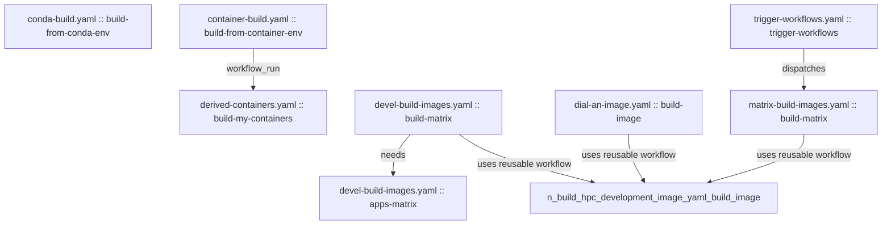

# Demonstration of GitHub Actions

Demonstration of several GitHub Actions useful within CI/CD workflows.

## Samples

### Building an Application Against a Matrix of Software Environments

The file [`.github/workflows/container-build.yaml`](https://github.com/benkirk/demo_github_actions/blob/main/.github/workflows/container-build.yaml) 
builds several applications within a matrix of compiler and MPI versions. The application builds can be enable and customized through inputs to the GitHub 
[`workfow_dispatch`](https://docs.github.com/en/actions/writing-workflows/choosing-when-your-workflow-runs/triggering-a-workflow#defining-inputs-for-manually-triggered-workflows)
event.

### Building Inside a Conda Environment on Multiple Architectures

The file [`.github/workflows/conda-build.yaml`](https://github.com/benkirk/demo_github_actions/blob/main/.github/workflows/conda-build.yaml)
builds a simple application within a `conda` environment on `x86_64` and `aarch64` platforms.

### Building a Container Image with `docker`

The file [`.github/workflows/derived-containers.yaml`](https://github.com/benkirk/demo_github_actions/blob/main/.github/workflows/derived-containers.yaml)
builds a container image from `containers/demo/Dockerfile`.

---
**Latest Status**

# HPC Container Build Workflow Chart

# Workflow Summaries

## build-hpc-development-image.yaml

* Purpose: Reusable workflow that builds, tests, and optionally publishes a single HPC development image variant.
* Triggers: workflow_call from other workflows.
* Key jobs:
* build-image: Build image layers, run image tests, and publish deployment image/tags when enabled.

## devel-build-images.yaml

* Purpose: Development/PR matrix build of selected compiler/OS/MPI combinations, followed by in-container app smoke tests.
* Triggers: workflow_dispatch, pull_request (Dockerfile and scripts paths).
* Key jobs:
* build-matrix: Calls the reusable build workflow for a reduced validation matrix.
* apps-matrix: Waits on build-matrix, then compiles/tests apps inside built images.

## matrix-build-images.yaml

* Purpose: Main production matrix build workflow across compilers, MPI stacks, GPU options, and architectures.
* Triggers: workflow_dispatch.
* Key jobs:
* build-matrix: Calls the reusable build workflow for full matrix combinations.

## dial-an-image.yaml

* Purpose: On-demand single-variant builder to reproduce and iterate quickly on one configuration.
* Triggers: workflow_dispatch.
* Key jobs:
* build-image: Calls the reusable build workflow using user-selected inputs.

## matrix-smoketest-applications.yaml

* Purpose: Runs app build/smoke tests inside already-published container images across a broad matrix.
* Triggers: workflow_dispatch.
* Key jobs:
* run-matrix: Executes hello-world and selected NCAR app build scripts in target images.

## trigger-workflows.yaml

* Purpose: Orchestrator workflow that dispatches matrix builds for selected base operating systems.
* Triggers: workflow_dispatch, monthly schedule, and closed pull_request on main.
* Key jobs:
* trigger-workflows: Uses GitHub CLI to dispatch matrix-build-images.yaml multiple times.

## container-build.yaml

* Purpose: Validates software builds inside pre-existing container images (hello world, DART, optional Kokkos).
* Triggers: workflow_dispatch, push to ci_cd.
* Key jobs:
* build-from-container-env: Runs compile/test tasks in matrix-selected container runtimes.

## derived-containers.yaml

* Purpose: Builds downstream/demo container images after container build workflow completion.
* Triggers: workflow_dispatch, workflow_run on completion of workflow named Container Build.
* Key jobs:
* build-my-containers: Builds containers/demo image variants.

## conda-build.yaml

* Purpose: Verifies compiler toolchain and hello-world builds from the conda environment definition.
* Triggers: workflow_dispatch, push to ci_cd, weekly schedule.
* Key jobs:
* build-from-conda-env: Sets up conda env from conda.yaml and compiles sample programs.

## manually-clean-action-log.yaml

* Purpose: Manual cleanup of old GitHub Actions logs.
* Triggers: workflow_dispatch with retention input.
* Key jobs:
* delete-old-actions: Invokes yanovation/delete-old-actions action.

## cron-clean-action-log.yaml

* Purpose: Scheduled cleanup of old GitHub Actions logs.
* Triggers: workflow_dispatch, monthly schedule.
* Key jobs:
* delete-old-actions: Invokes yanovation/delete-old-actions action.

## mega-linter.yml

* Purpose: Repository linting/quality checks.
* Triggers: Defined in the workflow file.
* Key jobs:
* Review this workflow directly for current lint tool scope and matrix details.

# Dependencies

## File-Level Dependencies

* container-build.yaml → derived-containers.yaml (workflow_run)
* devel-build-images.yaml → build-hpc-development-image.yaml (uses reusable workflow)
* dial-an-image.yaml → build-hpc-development-image.yaml (uses reusable workflow)
* matrix-build-images.yaml → build-hpc-development-image.yaml (uses reusable workflow)
* trigger-workflows.yaml → matrix-build-images.yaml (dispatches)

## Job-Level Dependencies

* container-build.yaml::build-from-container-env → derived-containers.yaml::build-my-containers (workflow_run)
* devel-build-images.yaml::build-matrix → build-hpc-development-image.yaml::build-image (uses reusable workflow)
* devel-build-images.yaml::build-matrix → devel-build-images.yaml::apps-matrix (needs)
* dial-an-image.yaml::build-image → build-hpc-development-image.yaml::build-image (uses reusable workflow)
* matrix-build-images.yaml::build-matrix → build-hpc-development-image.yaml::build-image (uses reusable workflow)
* trigger-workflows.yaml::trigger-workflows → matrix-build-images.yaml::build-matrix (dispatches)

## Workflows With No Explicit Cross-Workflow Links

* conda-build.yaml
* cron-clean-action-log.yaml
* manually-clean-action-log.yaml
* matrix-smoketest-applications.yaml
* mega-linter.yml
* update-workflow-dependency-tree.yaml